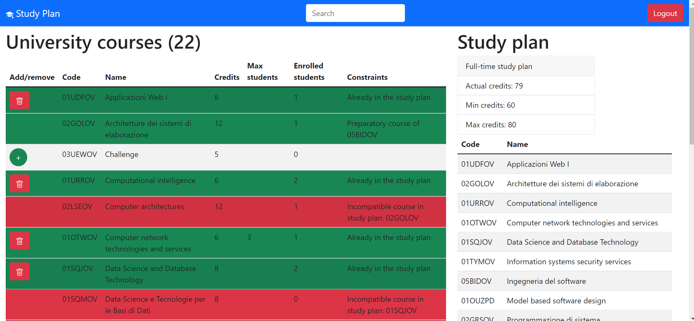

# Project: "StudyPlan"
- Developed a client-server website to organize the study plan of the university.
- Implemented frontend in React and backend using Node and Express.
- The server exposes some APIs that the client uses for CRUD operations.

## React Client Application Routes

- Route `/`: home page (unlogged) with the list of courses
- Route `/login`: login form with username and password
- Route `/studyPlan`: logged in page with 2 columns, the first with the list of courses and the second for the study plan (create, edit, delete)

## API Server

- POST `/api/login`
  - request body: JSON object with 'username' and 'password'
  - response: `201 Created` (success), `401 Unauthorized` (incorrect username and/or password) or `500 Internal Server Error` (generic error)
  - response body: JSON object with 'id', 'username' and 'name'
- GET `/api/userInfo`
  - request body: _None_
  - response: `200 OK` (success) or `401 Unauthorized` (error) or `500 Internal Server Error` (generic error)
  - response body: JSON object with 'id', 'username' and 'name'
- DELETE `/api/logout`
  - request body: _None_
  - response: `200 OK` (success) or `500 Internal Server Error` (generic error)
  - response body: _None_
- GET `/api/courses`
  - request body: _None_
  - response: `200 OK` (success) or `500 Internal Server Error` (generic error)
  - response body: array of JSON objects with 'id', 'code', 'name', 'credits', 'max_students', 'act_students', 'prel_course' and 'inc_courses'
- PUT `/api/studyPlan`
  - request body: JSON object with 'type' and 'credits'
  - response: Response status: `200 OK` (success), `503 Service Unavailable` (generic error), `422 Unprocessable Entity` (validation of body and/or user id failed)
  - response body: _None_
- GET `/api/studyPlan`
 - request body: _None_
 - response: `200 OK` (success), `500 Internal Server Error` (generic error), `422 Unprocessable Entity` (validation of user id failed)
 - responde body: JSON object with 'type' and 'credits'
- DELETE `api/studyPlan`
  - request body: _None_
  - response: `204 No Content` (success), `503 Service Unavailable` (generic error), `422 Unprocessable Entity` (validation of user id failed), `404 Not Found` (no study plan associated to user)
  - responde body: _None_
- POST `/api/studyPlan/course`
  - request body: JSON object with 'id', 'max_students' and 'act_students'
  - response: `201 Created` (success), `503 Service Unavailable` (generic error) or `422 Unprocessable Entity` (validation of body and/or user id failed)
  - response body: _None_
- GET `/api/studyPlan/courses`
  - request body: _None_
  - response: `200 OK` (success), `500 Internal Server Error` (generic error), `422 Unprocessable Entity` (validation of user id failed)
  - response body: array of JSON objects with 'id', 'code', 'name', 'credits', 'max_students', 'act_students', 'prel_course' and 'inc_courses'

## Database Tables

- Table `users` - 'id', 'username', 'name', 'hash', 'salt', 'study-plan', 'credits'
- Table `courses` - 'id', 'code', 'name', 'credits', 'max_students', 'act_students', 'prel_course'
- Table `inc_courses` - 'id', 'code', 'inc_course'
- Table `study_plans` - 'id', 'course_id', 'user_id'

## Main React Components

- `CoursesPage` (in `Pages/CoursesPage.js`): unlogged page with the list of all courses offered by the university, each course can be expanded to show any incompatible and/or preparatory courses
- `CoursesTable` (in `Components/CoursesTable.js`): table for the list of all courses used in the `CoursePage` and in the `StudyPlanPage`, for each row we have a `CourseRow` component
- `CourseRow` (in `Components/CoursesTable.js`): row of the `CoursesTable` with all the information about a course, in edit mode it contains also the add/remove button
- `MyNavbar` (in `Components/Navbar.js`): simple navbar with brand, search bar and dynamic link (component `LogLink`) to navigate trought the pages (login, home, logout)
- `LoginPage` (in `Pages/LoginPage.js`): login page with a simple classic login form (component `LoginForm`, username and password fields) 
- `StudyPlanPage` (in `Pages/StudyPlanPage.js`): logged in page with 2 columns, the first for the list of course (component `CoursesTable`) and the second for managing the study plan (components `ButtinsNewStudyPlan` to create a full-time or part-time study plan and `StudyPlanTable`)
- `StudyPlanTable` (in `Components/StudyPlanTable.js`): table for the list of courses of the study plan, for each row we have a `StudyPlanRow` component (only code and name)

## Screenshot

## Users Credentials

| username (registration number) | password | name |
|-------|----------|------|
| s295099 | bl1nk182 | John |
| s354044 | 45pizza54 | Mario |
| s194658 | password | testuser |
| s239784 | inter92 | Luke |
| s236911 | b4sk3tb411 | Mike |

## Tutorial

- "npm install" in both client and server
- "node index.js" to start server
- "npm start" to start client
